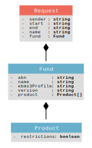

# update_super_product

## Request

#### sender ([Identifiers Australian Business Number Identifier](http://definitions.ausdx.io/definition/trc/de26)): string

A unique public identifier issued to all entities registered in the Australian Business Register (ABR), to be used in their dealings with government. Companies registered under the Corporations Law and business entities carrying on an enterprise in Australia are entitled to an ABN.

#### start ([Date](http://super.shuck.io/define/de5)): string

The date the super product listing takes effect

A specific day of a month in a year

#### end ([Date](http://super.shuck.io/define/de5)): string

The date the super product listing ends

A specific day of a month in a year

#### name ([Organisation Name Details Organisational Name Text](http://definitions.ausdx.io/definition/trc/de55)): string

The full name by which an organisation is known.

#### fund: [Fund](#fund)

## Fund

#### abn ([Identifiers Australian Business Number Identifier](http://definitions.ausdx.io/definition/trc/de26)): string

A unique public identifier issued to all entities registered in the Australian Business Register (ABR), to be used in their dealings with government. Companies registered under the Corporations Law and business entities carrying on an enterprise in Australia are entitled to an ABN.

#### name ([Organisation Name Details Organisational Name Text](http://definitions.ausdx.io/definition/trc/de55)): string

The full name by which an organisation is known.

#### ebms3Profile ([Electronic Contact Web Services ebMS3 Capability Profile Code](http://definitions.ausdx.io/definition/trc/de13268)): string

The fund's profile for secure transactions using ebMS3 web services

This is the code to indicate the profile selected by an entity  to state their capability  to enable the secure exchange of business to business transactions using the ebMS3  (Electronic Business Messaging Service 3) standard.

Valid values are:
Ultra-light  
Light 
High-end 
Large-volume 
Temporary-entry 
Application-gateway

For more information regarding ebMS3 Capability Profile, refer to Data and Payment Standards - Message Orchestration and Profiles (Version 1.1) available on www.ato.gov.au

#### version ([Electronic Contact Web Services Conformance To Standard Text](http://definitions.ausdx.io/definition/trc/de13265)): string

The standard and version the fund is certified for

This is the statement of standards and version for which the entity is certified.

#### product: [Product](#product)[]

## Product

#### restrictions ([Superannuation Product Details Employer Contribution Restriction Indicator](http://definitions.ausdx.io/definition/trc/de13263)): boolean

This indicates whether the superannuation product has restrictions on accepting contributions from employers.

A choice of TRUE/FALSE values.
true = Product has restrictions on contributions from some employers
false = Product has no restrictions on contributions from employers

